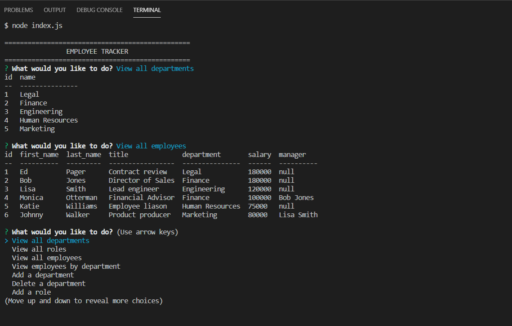

# Employee-Tracker

## Description

Employee-tracker was created in order to keep a database of employees. When the application begins, the user is given a menu of choices-'View all employees', 'View all departments', 'View all roles', 'View employees by department', 'Add a department', 'Delete a department', 'Add a role', 'Delete a role', 'Add an employee', 'Delete an employee', and 'Update an employee role'. Among these options, the user has access to find department names and ids, employee names, ids, roles, and managers. The user also has the ability to view the job title and salary in connection with the role id. The user can view tables of all information for the employees, departments, and roles, as well as change information for the employees, departments, and roles. Please see this video which displays the functionality. [screencastify Readme-generate](https://drive.google.com/file/d/1Nob_4kZyicROzRZaAwp0xqiwG8DA6afj/view).

## Images 
  

## Installation
    Node, NPM install inquirer, console.table, and MYSQL2
## Usage
    for personal use, run "node index js" in the command line to begin application
## License
    none
## Contributors
    Joanna Grosshans, creator
## Tests
    none
## Questions
jgrossh2  
[GitHub](https://github.com/jgrossh2/employee-tracker)  
Please contact <joannagrosshans2@gmail.com> for additional Information.

# Technologies used
 *JS  
 *JQUERY 
 *Node  
 *MYSQL2 
 